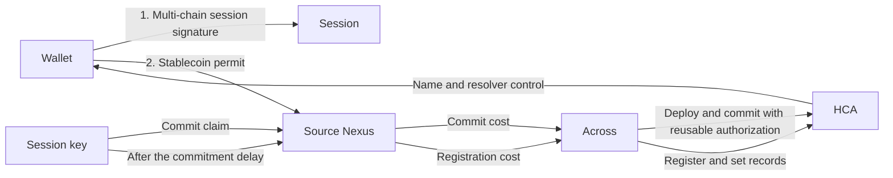

# HCA

## Purpose

An HCA is an optional ENS execution account. One wallet owns each HCA.

The HCA can:

- Submit commitments and register names for the wallet
- Deploy or use the wallet's resolver
- Set resolver records and the wallet's primary name
- Keep resolver authority for later session actions
- Use one session for more than one registration or name update
- Pay registration and execution costs with supported tokens
- Receive funds from a supported source chain
- Execute an owner-authorized renewal or fund recovery
- Perform supported registry actions after explicit wallet approval

The HCA gives an application a continuous in-app experience. A valid session can complete later ENS actions without another wallet prompt. A Rhinestone route can sponsor execution or charge its cost in a supported stablecoin.

The HCA is not the user's identity or a general wallet. It does not own registered names. `ETHRegistrar` assigns each name to the wallet. The wallet also receives resolver `ROLES.ALL` during registration.

The HCA keeps its resolver roles after registration. These roles support later session actions. The wallet can revoke the roles or invalidate the reusable session authorization.

The application must not select an HCA without user approval. A direct wallet or a capable smart account can use a simpler route.

## System parts

A registration uses an HCA on the registration chain. A cross-chain registration also uses the user's Nexus on the source chain. The Nexus gets the authorized source funds. The HCA makes the ENS calls.

| Contract                      | Function                                                                   |
| ----------------------------- | -------------------------------------------------------------------------- |
| `StandaloneSingleOwnerHCA`    | Reads its certified owner, executes calls, revokes sessions, and controls upgrades. |
| `StandaloneHCAFactory`        | Approves initial implementations and stores each deployed HCA's immutable owner certification. |
| `PermissionedResolver`        | Stores records and grants the HCA and wallet permission to manage them.    |
| `HCAOwnerAndSessionValidator` | Validates owner actions and the fixed ENS session policy.                  |
| `HCAFundingSessionValidator`  | Limits how a source Nexus can fund the HCA.                                |
| `PermissionedAddressSet`      | Stores the implementation upgrades that the DAO permits.                   |

The HCA uses a Nexus implementation with a fixed validator and executor. Nexus authorizes the fixed
executor directly from the immutable account configuration, so HCA proxy initialization does not
write the executor's optional per-account initialization marker. The source Nexus uses the fixed
funding validator. The HCA prevents module installation and removal. An approved upgrade can change
the fixed modules.

The destination validator pins the long-lived `ETHRegistry`, not one registrar deployment. Each operation batch selects at most one registrar, which must hold the registry's root `ROLE_REGISTRAR`; registrar calls and payment-token approvals in that batch must use the selected deployment. Different batches can select different authorized registrars, supporting concurrent deployments and registrar replacement without an HCA implementation upgrade. Revoking the role disables the registrar for existing sessions immediately.

The HCA rejects delegatecall execution and the standard ERC-721 and ERC-1155 receiver callbacks. It can hold ETH or supported tokens during an operation. Do not use it for long-term funds.

### HCA address

The factory calculates the HCA address from the owner, implementation, and user salt:

```text
deploymentSalt = keccak256(abi.encode(userSalt, owner, initialImplementation))
HCA = VerifiableFactory proxy address for (StandaloneHCAFactory, deploymentSalt)
```

Anyone can call `StandaloneHCAFactory.deploy(owner, implementation, userSalt)` for an implementation approved by factory governance. The caller cannot change the expected owner, implementation, or HCA address. After deployment, the factory verifies the implementation and owner and permanently records the HCA-to-owner binding used by HCA-aware reverse adapters.

Factory-backed HCAs read `owner()` from this certification instead of writing a duplicate owner
slot during proxy initialization. The legacy owner slot remains in the account storage layout so an
upgrade does not move the session nonce or later storage. Direct deployments whose implementation
has no owner registry continue to initialize and read that legacy slot.

Use these values for this account version:

| Field                  | Required value                                                     |
| ---------------------- | ------------------------------------------------------------------ |
| SDK account version    | `ens-standalone-1.1.0`                                             |
| On-chain `accountId()` | `ens-standalone-hca.1.1.0`                                         |
| `userSalt`             | `0`                                                                |
| Initial implementation | `StandaloneHCAImplementation` from the selected network deployment |

The SDK version and the account ID are different identifiers. Do not compare them. The initial implementation is part of the HCA address. A different initial implementation gives the wallet a different predicted HCA.

An in-place upgrade does not change the HCA address. Keep the initial implementation in the stored account configuration after an upgrade. `VerifiableFactory.verifyContract(hca)` returns the current implementation.

Do not change the initial implementation or `userSalt` for an existing account.

### Verify an existing HCA

Complete these checks before you use an HCA that already has code:

1. Calculate the expected HCA address.
2. Call `owner()`. The result must equal the connected wallet.
3. Call `accountId()`. The result must equal `ens-standalone-hca.1.1.0`.
4. Call `VerifiableFactory.verifyContract(hca)`. At launch, the result must equal the initial implementation. After an upgrade, it must equal an implementation that the DAO approved.
5. Call `StandaloneHCAFactory.authorizedOwnerOf(hca)`. The result must equal the connected wallet.

Stop if a check fails. Do not select a different account without user approval.

An address with no code is a predicted address. The first Rhinestone route can deploy it. Refresh the code before submission. Another caller can deploy the expected HCA first. If this occurs, verify it and omit the deployment operation.

### Shared deployment

The phase-1 migration deploys the shared HCA contracts on an HCA-enabled network. It also configures the reverse adapters and approves the initial HCA implementation in `StandaloneHCAFactory`. See the [phase-1 migration runbook](../contracts/docs/migration.md#phase-1-deploy-v2-contracts).

Phase 1 does not deploy an HCA for each wallet. The first user operation deploys the wallet's HCA when necessary.

Use these commands to update the shared HCA contracts and their reverse adapters on Sepolia:

```sh
bun run migration -- phase deploy-v2 --network sepolia --resume --tags hca \
  --defer-v1-owner-transactions \
  --deferred-v1-owner-transactions-file .dev/hca-v1owner.jsonl
bun run migration -- phase execute-owner-txs --network sepolia \
  --role v1Owner --file .dev/hca-v1owner.jsonl
```

Run the commands from `contracts`. The deployment reuses existing core records, replaces HCA
contracts and adapters only when their bytecode or constructor arguments changed, and prepares
replacement-adapter grants followed by revocations of every recorded prior adapter. The
`execute-owner-txs` step applies those controller changes. After it completes, verify that both
replacement adapters are controllers and every superseded adapter is not.

### Test networks

Sepolia remains the current core registration network. The checked-in HCA deployments predate the
stateless validator source in this branch and must not be enabled for that flow.

| Use          | Network          |   Chain ID | Payment token                                        | Funding validator                            | HCA frontend status          |
| ------------ | ---------------- | ---------: | ---------------------------------------------------- | -------------------------------------------- | ---------------------------- |
| Registration | Sepolia          | `11155111` | USDC at `0x1c7D4B196Cb0C7B01d743Fbc6116a902379C7238` | Not applicable                               | Pending compatible deploy    |
| Source       | Base Sepolia     |    `84532` | USDC at `0x036CbD53842c5426634e7929541eC2318f3dCF7e` | `0x6FC0FdE0960003AcB24810FFd5dB6224B3d88974` | Legacy; do not enable        |
| Source       | Arbitrum Sepolia |   `421614` | USDC at `0x75faf114eafb1BDbe2F0316DF893fd58CE46AA4d` | Not deployed                                 | Do not enable                |

Use the [Sepolia deployment address table](../contracts/docs/addresses/sepolia.md) to reconcile
shared contract deployments. Do not publish its legacy HCA entries in an enabled frontend manifest.
A compatible frontend deployment needs these entries:

- `DefaultReverseRegistrarAdapter`
- `ETHRegistrar`
- `HCAOwnerAndSessionValidator`
- `PermissionedResolverImpl`
- `StandaloneHCAFactory`
- `StandaloneHCAImplementation`
- `VerifiableFactory`

Each enabled source network needs an approved `HCAFundingSessionValidator` compiled from the
compatible source. Put its address in the frontend network manifest. Do not deploy this validator
for a user.

The historical addresses remain in the deployment records as on-chain facts. They do not prove
compatibility with the stateless destination or source validator formats. Until compatible shared
contracts are deployed and recorded, operators must provide proof-deployment overrides and keep the
HCA frontend disabled.

These networks do not prove mainnet support.

## User routes

Count each signature or transaction as one wallet interaction. Do not count wallet connection or a network switch.

Manager means the ENS Manager application. Explorer means the ENS Explorer application.

| Action                              | Route                                         |                                    Wallet interactions | Result                                                        |
| ----------------------------------- | --------------------------------------------- | -----------------------------------------------------: | ------------------------------------------------------------- |
| Cross-chain registration            | Stablecoin-paid Rhinestone session            |                           2 signatures, 0 transactions | Deploy, commit, and register from a selected source chain.    |
| Same-chain registration             | Stablecoin-paid Rhinestone session            | 2 signatures, 0 transactions for a fresh funded wallet | Deploy, fund, commit, and register on the registration chain. |
| Sponsored same-chain registration   | Sponsored Rhinestone session                  |    1 owner signature, plus any required funding action | Sponsor execution, then use the session for the reveal.       |
| Later record or primary-name update | Existing Rhinestone session                   |                           0 while the session is valid | Make an allowed update in the application.                    |
| Wallet-paid HCA action              | Direct `executeByOwner` transaction           |                           1 transaction for each batch | Use the HCA as an owner-controlled multicaller.               |
| Renewal                             | Payer, owner-authorized HCA, or direct wallet |                          Depends on the selected route | Renew outside the fixed session.                              |
| Registry approval                   | Direct wallet                                 |                                          1 transaction | Give or remove persistent registry authority.                 |
| Session revocation                  | Direct wallet                                 |                                          1 transaction | Invalidate all current HCA sessions.                          |
| Fund recovery                       | Direct `executeByOwner` transaction           |                                          1 transaction | Send HCA funds to an owner-selected address.                  |

Manager must select the supported route with the fewest wallet interactions. Explorer can show all supported routes and their interaction counts.

The same-chain and cross-chain stablecoin routes have current live proofs.

One multi-chain session authorization can support either stablecoin route. The wallet signs it before route selection. A same-chain route uses the HCA session. A cross-chain route also uses the session for the selected source Nexus.

## Registration

Each registration has a commitment and a reveal. The reveal can occur after `MIN_COMMITMENT_AGE`. It must occur before `MAX_COMMITMENT_AGE`.

### Cross-chain stablecoin route

This route uses the user's Nexus on the payment chain. It uses the HCA on the registration chain. Both accounts have known addresses before deployment.

Enable this route only on a source network with an approved funding validator and a tested payment token.



The route has these steps:

1. Derive the HCA and the source Nexus for each payment option in the authorization.
2. Create one destination session and one source session for each of these options.
3. Ask the wallet for one Rhinestone multi-chain session signature. This signature does not select a payment chain or move funds.
4. Let the user select a supported payment chain and token.
5. Get a route quote. Show the permit limit and the expected charge.
6. Ask the wallet for one native stablecoin permit. The source Nexus is the spender.
7. Submit the commit route with the session key. The wallet must not sign Permit2.
8. Pull only the quoted commit cost. Keep the registration funds in the wallet.
9. Deploy the source Nexus and HCA when necessary. Submit the commitment with the reusable destination authorization.
10. After the delay, get a new registration price and route quote.
11. Submit the reveal route with the session key. Do not ask the wallet for another signature.
12. Pull the quoted reveal cost. Register the name and make the selected ENS updates.

This route has two wallet signatures and no wallet transaction. The wallet does not need native gas. Rhinestone submits the source claim and the destination fill.

This route is not sponsored. The stablecoin quote includes registration, execution, and bridge costs. Sponsorship remains a separate product choice.

The stablecoin permit sets a limit. It does not move funds. Each claim pulls its exact quoted source amount. The source Nexus has no token balance after a successful claim. Unused funds stay in the wallet.

Rhinestone does not define a fixed buffer for this route. The frontend can set a permit limit above the first quote. It must show the limit to the user. The source policy also limits each claim.

This route needs a token with a native permit that the Nexus can execute. A token without this permit needs an approval transaction and native source-chain gas.

### Same-chain stablecoin route

This route uses the wallet, HCA, and registrar on the same chain.

For a fresh HCA with insufficient USDC, the wallet performs two actions:

1. Sign one multi-chain session authorization before route selection.
2. Sign an EIP-2612 permit with the HCA as spender after the user selects the same-chain route.

The first Rhinestone request contains these source calls:

1. `USDC.permit(wallet, HCA, amount, deadline, v, r, s)`
2. `USDC.transferFrom(wallet, HCA, amount)`

The first session action calls `ETHRegistrar.commit(commitment)`. Its signature envelope carries the owner-authorized session proof and the execution-fee limits.

The session key submits the full commit request. The first request also carries the wallet's session authorization. After the delay, the session key submits the reveal batch. The wallet does not sign again. The route has two wallet signatures, no wallet transaction, and no native-gas requirement.

The same-chain route moves its selected budget into the HCA during the commit request. Unused USDC stays in the user-owned HCA. The user can use it for later operations or recover it with `executeByOwner`.

A sponsored same-chain route uses the same reusable proof without an execution-fee charge. Sponsorship pays execution fees. It does not pay the ENS registration price. If the HCA needs payment tokens, the route needs a separate funding authorization.

### Wallet-paid HCA route

The wallet can call `HCA.executeByOwner(executions)` directly. This call makes the HCA an atomic, owner-controlled multicaller. The wallet transaction is the owner authorization. Do not request a second HCA signature.

A wallet-paid registration needs one commitment transaction and one reveal transaction. A new HCA can also need deployment and funding transactions. The wallet pays native gas.

Use this route when the HCA must be the caller and a Rhinestone route is not suitable. A direct wallet call is simpler when the HCA does not need to be the caller.

### Commitment data

Read the commitment with this call:

```text
ETHRegistrar.makeCommitment(
  label,
  wallet,
  secret,
  address(0),
  resolver,
  duration,
  referrer
)
```

Submit it with `ETHRegistrar.commit(commitment)`. Store all inputs until the reveal completes. The reveal must use the same label, wallet, secret, subregistry, resolver, duration, and referrer.

Read the reveal price immediately before you build the reveal:

```text
(base, premium) = ETHRegistrar.getRegisterPrice(label, duration, paymentToken)
price = base + premium
```

### Reveal batch

The reveal is one atomic HCA operation. Set `value` to zero for every inner call.

| Order | Call                                                                        | Required values                                                                                                                           |
| ----: | --------------------------------------------------------------------------- | ----------------------------------------------------------------------------------------------------------------------------------------- |
|     1 | `VerifiableFactory.deployProxy(...)`                                        | Use the approved `PermissionedResolver` implementation and selected salt. Initialize both the HCA and wallet with root `ROLES.ALL`; supported records may be included in the initializer multicall and must target the intended DNS-encoded name. Omit this call if the resolver exists. |
|     2 | `paymentToken.approve(ETHRegistrar, price)`                                 | Approve only the current registration price. Use a token the registrar's rent price oracle accepts.                                      |
|     3 | `ETHRegistrar.register(...)`                                                | Use the wallet as owner, the session resolver, and the commitment inputs.                                                                 |
|     4 | Resolver setters                                                            | Add only records not already written during initialization, or records for an existing resolver.                                          |
|     5 | `DefaultReverseRegistrarAdapter.setNameWithHCA(wallet, name)`               | Add this call when the user selects a primary name.                                                                                       |
|     6 | `ReverseRegistrarAdapter.claimWithHCA(wallet, resolver)`                    | Add this call to claim the wallet's `addr.reverse` node. Use the session resolver or the zero address.                                   |

The resolver DNS root (`0x00`) is the lookup key for an optional default forward-record profile. It
is unrelated to `default.reverse`. This flow leaves the root unlinked and targets registration
record setters at the exact name.

The session supports these resolver calls:

- `setABI`
- `setAddress`
- `setContenthash`
- `setData`
- `setInterface`
- `linkToNode`
- `linkToRecord`
- `setName`
- `setText`
- Supported resolver multicalls

When `PermissionedResolver.setName(...)` targets the wallet's Ethereum `addr.reverse` name, it writes the chain-specific primary-name record. `setNameWithHCA(...)` writes the wallet's `default.reverse` primary name. Use the mechanism selected by the product rather than adding both by default.

If any call fails, the full batch reverts. The registrar does not keep the payment. It does not consume the commitment.

The HCA keeps its resolver roles. The wallet becomes a co-administrator. Do not revoke the HCA roles after registration.

The same HCA, resolver, and session can register more names. Each name needs a new commitment. A session for a different resolver needs new wallet authorization.

## Other HCA actions

### Resolver records and primary name

A valid session can change supported resolver records. It can also call `setNameWithHCA(wallet, name)` and `claimWithHCA(wallet, resolver)`. These actions do not need a new wallet prompt.

The session can select the record values and primary-name string. The HCA must still own the required resolver roles. The reverse adapter must trust the HCA implementation. A reverse claim must name the wallet and use the session resolver or the zero address.

### Renewal

The fixed session does not permit renewal. Use one of these routes:

- A payer route that does not need name authority
- A new owner-authorized HCA action
- A direct wallet route

Do not send renewal through the existing HCA session.

### Registry approval

`ETHRegistry.setApprovalForAll(HCA, true)` gives the HCA persistent registry-token operator authority. It also gives inherited non-root roles.

Registration does not need this approval. Do not request it for a one-time resolver change. It is useful only when the user expects more registry actions.

Manager must not request this approval at launch. Explorer can show controls to enable and revoke it. Explorer must explain the scope and leave the choice to the user.

Manager does not support HCA subname creation at launch. Use a direct wallet route for transfers by default.

### Session revocation

The wallet can call `HCA.revokeSessions()` on the registration chain. This call invalidates all current sessions. It requires one wallet transaction and native gas.

The wallet must call this function directly. Do not put it inside `executeByOwner`.

This call does not revoke a source Nexus session. The Nexus owner can uninstall `HCAFundingSessionValidator` to revoke that session. The validator deletes the session when the Nexus uninstalls it.

The source stablecoin allowance is separate. Uninstalling the validator does not clear the allowance. The wallet can clear it as an additional safeguard.

### Owner execution and recovery

The wallet can call `HCA.executeByOwner(executions)` for an atomic owner action. Use it for fund recovery and other explicit owner actions. The fixed session policy does not limit this route.

The owner validator also accepts owner-signed ERC-4337 UserOperations. Local tests cover this contract path. This repository does not record a production bundler and paymaster proof. Do not make it a default frontend route until that integration is proved.

### Upgrades

An HCA upgrade needs all these approvals:

- The HCA owner starts the upgrade.
- The current implementation's upgrade set permits the new implementation.
- The predecessor set of the new implementation permits the current implementation.

The DAO controls the sets. The initial implementation has no predecessor set. A deployed HCA cannot upgrade to the initial implementation.

## Session policy

### Destination HCA session

A reusable HCA session authorization binds these values:

- Session key
- Expiry
- Resolver
- HCA session nonce
- Optional execution-fee limits

The fee limits specify the refund token, exchange rate, gas overhead, and maximum token amount.

The session permits:

- Commitment and registration calls to registry-authorized registrars
- Deployment of the approved resolver implementation
- Supported resolver record changes
- Primary-name changes for the HCA owner
- Supported payment-token approvals
- The required wallet resolver-role grant

The validator applies these rules:

- Registration must assign the name to the HCA owner.
- Registration must use the resolver in the session.
- Every registrar call and registrar payment-token approval in a batch must use the same registrar.
- A new resolver must use the approved `PermissionedResolver` implementation, grant root `ROLES.ALL` to exactly the HCA and wallet, and include only supported resolver setters in its initializer multicall.
- An existing resolver must verify against the approved implementation.
- Every registration must give root `ROLES.ALL` to the wallet.
- A registrar approval can name only the batch's current root `ROLE_REGISTRAR` holder as spender.
- An execution-fee approval must match the signed fee and the session limits.
- A first same-chain action can use one wallet permit followed by the same-value transfer into the HCA.

The validator does not store this authorization. Each destination signature carries the reusable proof, and the HCA session nonce invalidates it globally. The session key can select labels, records, and primary-name strings. The owner does not pre-sign one fixed registration. The session can register more than one name before expiry or revocation.

Registrar-role governance is therefore part of the session trust boundary: granting the role makes that registrar available to already-authorized, short-lived sessions, while revocation removes it. The remaining selector, registrant, and resolver checks still apply to every authorized registrar.

The session does not permit:

- Renewal
- Resolver replacement
- Authority grants to another account
- Registry approval
- Name transfer
- Subname creation
- Module or upgrade management
- Token transfers to arbitrary targets
- Calls to arbitrary targets

### Source funding session

One multi-chain authorization must include the destination HCA and one source session. It can include more source sessions. This lets the user select a listed source later.

Each source session fixes these values:

- Wallet, session key, and expiry
- Source token and maximum source amount
- Destination HCA, chain, token, and maximum destination amount

For each claim, `HCAFundingSessionValidator` checks the owner authorization, session signature, Permit2 claim, and source calls. It permits only the required stablecoin permit, wallet-to-Nexus transfer, and Permit2 approval.

The validator gets the active Permit2 Across claim adapter from the Rhinestone Router. The source session trusts that adapter to deliver the signed output. A compatible adapter update does not need a new wallet authorization. A new claim format needs a new validator.

The wallet-to-Nexus transfer must equal the claim amount. The validator rejects arbitrary calls and UserOperations.

The first claim can set the stablecoin permit and Permit2 approval. Later claims can use the remaining permit and approval. They do not need a new wallet signature.

The native stablecoin permit must cover the commit claim and the later reveal claim. The reveal uses a new quote. If the remaining allowance does not cover that quote, the wallet must sign a new permit.

## Frontend integration

### SDK

This repository uses `@rhinestone/sdk` version `1.8.0` with the Bun patch at [`patches/@rhinestone%2Fsdk@1.8.0.patch`](../patches/@rhinestone%2Fsdk@1.8.0.patch).

Stock SDK `1.8.0` does not support this standalone HCA. Use the patch or a later SDK release that contains the same support.

Replace any existing unversioned HCA account state. Do not reuse `owners.type = "ens"`, `ownerExpirations`, `updateConfig`, or a session key installed as a temporary owner. Derive the standalone HCA as a new account.

The patch adds only the account-specific work that the SDK needs:

- Derive and deploy the HCA through `StandaloneHCAFactory`.
- Use the fixed HCA and source funding validators with Rhinestone sessions.
- Keep each session account and salt, and use the HCA configuration for the destination signature.

Rhinestone keeps its existing Smart Session typed data, Permit2 and Across messages, and owner
signature format. The patch transports those values in an HCA-specific compact envelope. The
frontend must not encode that envelope, call an executor, or call a paymaster directly.

### Destination account configuration

Create the HCA account with this configuration:

```ts
const accountConfig = {
	account: {
		type: "hca",
		version: "ens-standalone-1.1.0",
		factory: STANDALONE_HCA_FACTORY,
		implementation: STANDALONE_HCA_IMPLEMENTATION,
		validator: HCA_OWNER_AND_SESSION_VALIDATOR,
		verifiableFactory: VERIFIABLE_FACTORY,
		proxyLogic: VERIFIABLE_FACTORY_PROXY_LOGIC,
		userSalt: 0n,
	},
	owners: {
		type: "ecdsa",
		accounts: [walletOwner],
		module: HCA_OWNER_AND_SESSION_VALIDATOR,
	},
	experimental_sessions: {
		enabled: true,
		module: HCA_OWNER_AND_SESSION_VALIDATOR,
	},
};
```

Call `sdk.createAccount(accountConfig)` to derive a new or predicted HCA. If verified code exists, call `sdk.createAccount({...accountConfig, initData: {address: hca}})`.

Set `proxyLogic` to the result of `VerifiableFactory.proxyLogic()` for the selected network.

Do not add recovery configuration or other modules. The HCA blocks module changes.

The SDK adds `StandaloneHCAFactory.deploy(owner, implementation, userSalt)` when a new HCA needs setup. Do not send a separate deployment transaction for a Rhinestone route.

### Resolver selection

Select one resolver salt. Derive the resolver as a `VerifiableFactory` proxy with these values:

| Field          | Value                                                                          |
| -------------- | ------------------------------------------------------------------------------ |
| Deployer       | HCA                                                                            |
| Implementation | Approved `PermissionedResolverImpl`                                            |
| Salt           | Frontend-selected resolver salt                                                |
| Initializer    | Root `ROLES.ALL` grants for the HCA and wallet plus supported exact-name records |

Bind the session to this exact resolver. One session can use the resolver for more than one name. A different resolver needs a new session authorization.

### Session authorization

Use one ECDSA session key. Store it with the same protection as other application session keys.

Create these sessions before the wallet selects a same-chain or cross-chain route:

- One destination session for the HCA
- One or more source sessions for the payment options in the authorization

Each session must name its account, chain, salt, and session key. Call `experimental_getSessionDetails(sessions)` on the HCA account. Then call `experimental_signEnableSession(details)` once. The result does not select a payment route and does not move funds.

Use the HCA entry for a same-chain route. For a cross-chain route, also use the entry for the selected source Nexus. One source session is sufficient when the user selects the source first. Include each offered source when the user selects it after authorization. Do not ask the wallet to sign a Permit2 message.

Pass the signed authorization as `enableData` for every destination session request. The SDK packages it into the HCA signature envelope; do not add a validator call to the HCA action list. The same authorization can be reused until its expiry or until the owner increments the HCA session nonce.

`experimental_isSessionEnabled(session)` remains false for the stateless destination validator. Persist the signed authorization with the session state instead of treating on-chain enablement as the resume signal.

The patched SDK and HCA validators use this compact transport encoding:

- A multi-chain entry is an eight-byte chain ID followed by its 32-byte session digest. The proof
  carries a one-byte selected index, a one-byte entry count, the ordered entries, and the 65-byte
  owner signature.
- A destination proof prefixes those entries with the session key, expiry, session nonce, resolver,
  and fixed refund limits using the on-chain field widths.
- A session operation contains the two significant mode bytes, a one-byte execution count, and one
  entry per call: target, three-byte calldata length, and raw calldata. Execution values are omitted
  because every permitted HCA session action requires zero value.
- A first-use same-chain refund carries a 96-bit exchange rate, 96-bit maximum refund amount, and
  48-bit gas overhead. These widths match the limits authorized in the session salt.

Do not substitute standard ABI tuple encoding for these fields. A stock SDK or an older HCA
validator uses a different envelope and is not wire-compatible.

### Source Nexus configuration

Create one user-owned Nexus for each source session in the authorization. Use one ECDSA owner. Install the approved `HCAFundingSessionValidator` as its fixed session validator.

Encode this source session configuration as validator initialization data:

```text
permissionId
owner
validUntil
sessionKey
sourceToken
destinationRecipient
destinationToken
destinationChainId
maxSourceAmount
maxDestinationAmount
```

Pass this data in `experimental_sessions.initData`. The SDK includes the Nexus setup in the first source route.

### Rhinestone requests

Use these request parts for each route:

| Request            | Source work                                           | HCA calls                                | Signer                                                             |
| ------------------ | ----------------------------------------------------- | ---------------------------------------- | ------------------------------------------------------------------ |
| Same-chain commit  | Stablecoin permit and transfer to HCA, when needed    | `commit`                                 | Destination session with reusable wallet authorization             |
| Same-chain reveal  | None                                                  | Reveal batch                             | Session key                                                        |
| Cross-chain commit | Permit and exact commit-cost transfer to source Nexus | `commit`                                 | Source and destination sessions with reusable wallet authorization |
| Cross-chain reveal | Exact reveal-cost transfer to source Nexus            | Reveal batch                             | Source and destination sessions                                    |
| Later name update  | None                                                  | Supported resolver or primary-name calls | Destination session                                                |

For an unsponsored route, set the supported stablecoin as `feeAsset`. Disable gas, bridge, and swap sponsorship. Let the SDK add its Permit2 claim, account setup, route fees, and required approvals.

For a cross-chain route, pass the full destination HCA configuration as the recipient. Do not pass only the HCA address. Select Across as the settlement layer.

For the first cross-chain commit, attach the multi-chain enable data to both session entries. The destination call list contains `ETHRegistrar.commit(commitment)`; the destination authorization remains in the signature envelope.

For the reveal, refresh the price and quote. Pull only the reveal quote from the wallet. Do not reuse the first quote. Do not request another wallet signature.

### State and recovery

Store enough data to reproduce the reveal:

- HCA configuration and address
- Source Nexus configuration and address
- Resolver address and salt
- Session key, permission IDs, authorization, and expiry
- Label, secret, duration, subregistry, and referrer
- Commitment and valid reveal times
- Permit limit and remaining allowance
- Rhinestone request, claim, and fill identifiers

Wait for the source claim and destination fill before you advance the route. This wait confirms route completion. It is not a read after an atomic write.

Read current state when it is an input or the application did not create it. Examples include name availability, HCA adoption, commitment time, registration price, and a stored session.

Do not add immediate reads after a successful atomic batch. If an inner call fails, the batch reverts.

Show clear recovery states for these cases:

- The HCA or source Nexus was deployed by another caller.
- The session expired or was revoked.
- The stablecoin permit or route quote is no longer sufficient.
- The source claim or destination fill failed.
- The commitment is too new or expired.
- The registration price changed.

The frontend owns its UI, state model, storage method, resolver salt, session lifetime, and route presentation.

## Local development

Start the devnet and mockestrator from the repository root:

```sh
docker compose --profile default up -d --build mockestrator
```

| URL                                 | Service                                |
| ----------------------------------- | -------------------------------------- |
| `http://127.0.0.1:8545`             | Devnet RPC                             |
| `http://127.0.0.1:8000/deployments` | Local deployment addresses             |
| `http://127.0.0.1:3007`             | Mock Rhinestone route and fill service |

Set these frontend variables:

```env
VITE_RHINESTONE_ENDPOINT_URL=/orchestrator
VITE_RHINESTONE_CUSTOM_RPC_URLS={"31337":"http://127.0.0.1:8545"}
```

The mockestrator supplies local route and fill responses. It is not an HCA adapter, bundler, or paymaster. It does not prove the production authorization path.

Frontend feature code must use the Rhinestone SDK. It must not call port `3007` directly. Manager does not yet support the standalone HCA or chain `31337`. The local stack therefore does not give an end-to-end Manager route.

## Verification

The checked-in Sepolia HCA implementation, destination validator, and Base Sepolia funding validator
are legacy deployments. They do not match the stateless sources in this branch. Do not run the live
proof against the default deployment records.

After compatible shared contracts are deployed, run a live proof from `contracts` with
`HCA_PERMISSIONED_RESOLVER_IMPL`, `HCA_OWNER_AND_SESSION_VALIDATOR`,
`HCA_STANDALONE_HCA_IMPLEMENTATION`, and, for cross-chain routes,
`HCA_FUNDING_SESSION_VALIDATOR` set to those proof deployments:

```sh
HCA_OWNER_KEY_FILE=<fresh-wallet-key-file> \
bun run check:hca-live -- cross-chain
```

Use `bun run check:hca-live -- --help` to list all proof routes. Each command changes testnet state.

| Command                                                | Route                                                               |
| ------------------------------------------------------ | ------------------------------------------------------------------- |
| `bun run check:hca-live -- same-chain`                 | Sponsored same-chain registration                                   |
| `bun run check:hca-live -- same-chain-usdc`            | Same-chain registration paid with wallet USDC                       |
| `bun run check:hca-live -- same-session`               | Same authorization used for same-chain and cross-chain registration |
| `bun run check:hca-live -- cross-chain`                | Deferred cross-chain registration with two wallet signatures        |
| `bun run check:hca-live -- cross-chain-upfront-permit` | Comparison route that pulls the source budget at commit             |
| `bun run check:hca-live -- cross-chain-wallet-funded`  | Comparison route with a wallet funding transaction                  |

For the cross-chain proof, fund the printed wallet with Base Sepolia USDC. Do not fund it with native gas. The command also needs Sepolia and Base Sepolia RPC URLs, `DEPLOYER_KEY`, and `RHINESTONE_API_KEY`.

The same-chain commands need `HCA_OWNER_KEY` for a fresh Sepolia wallet with enough USDC. The `same-chain-usdc` route also charges execution fees in USDC.

The `same-session` command needs `HCA_OWNER_KEY_FILE`. Its wallet needs enough USDC on Sepolia and Base Sepolia because the command proves both choices in sequence.
Its generated labels are twelve ASCII characters, keeping the corresponding `https://euc.li/<label>.eth` avatar within Solidity's 31-byte short-string representation for consistent gas measurements.

The current historical Sepolia addresses are listed in
[`contracts/docs/addresses/sepolia.md`](../contracts/docs/addresses/sepolia.md), and the Base Sepolia
deployment record is stored in
[`contracts/deployments/base-sepolia/HCAFundingSessionValidator.json`](../contracts/deployments/base-sepolia/HCAFundingSessionValidator.json).
These records must be regenerated only as part of an actual compatible deployment; do not edit them
to describe locally compiled bytecode that has not been deployed.
